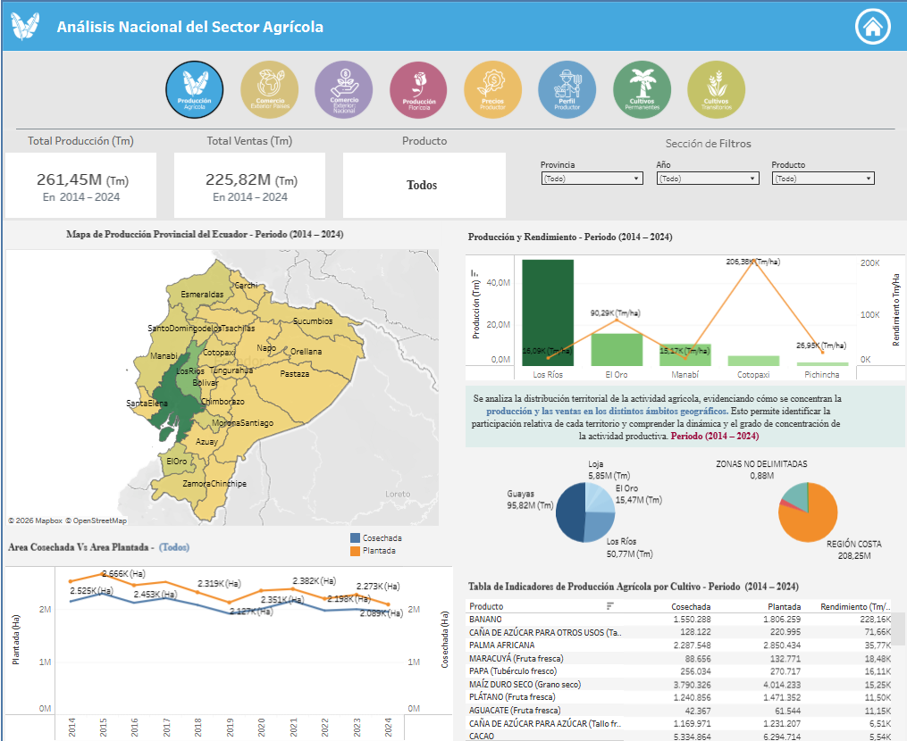
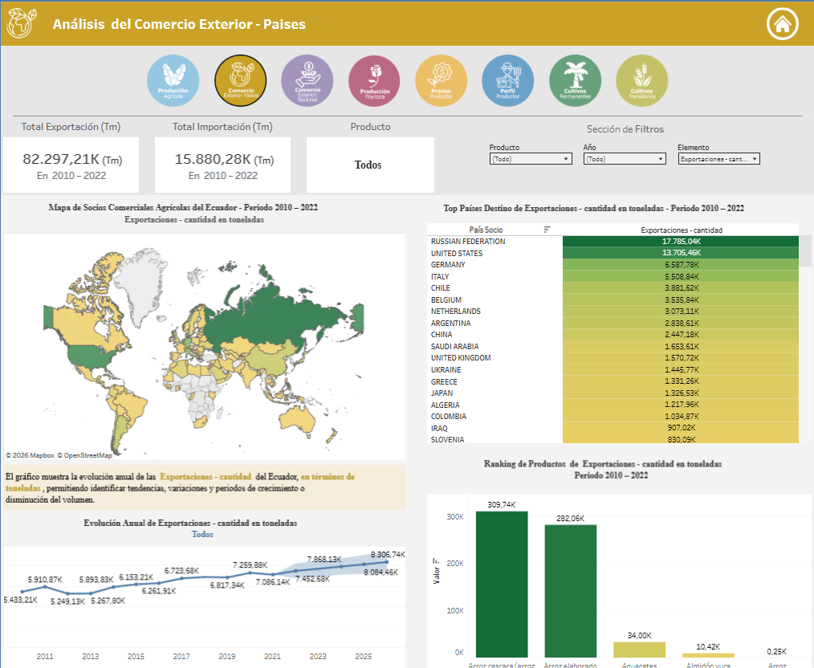
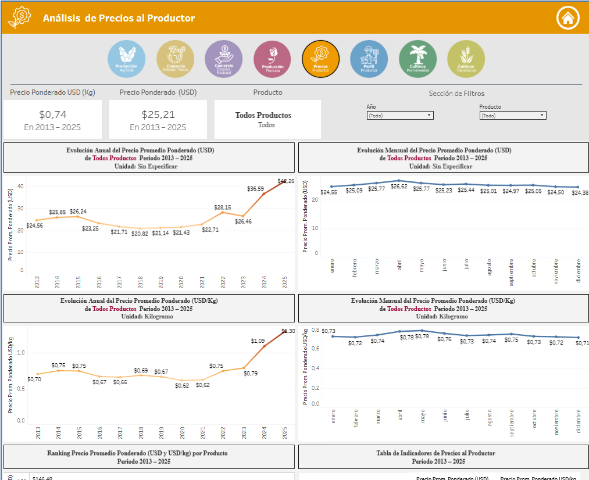

# 🌾 Panorama of the Agricultural Sector of Ecuador

Big Data system and interactive dashboards for strategic decision-making in the Ecuadorian agricultural sector.

---

> 📊 **Live Dashboards**: [View on Tableau Public](https://public.tableau.com/app/profile/jean.avila7337/viz/PanoramadelSectorAgrcoladelEcuador/ResumenDash)

---

## Featured Dashboard



*Interactive dashboard showing agricultural production overview with dynamic filters by year, product, and province.*

---

## Tech Stack

[](https://community.cloud.databricks.com/)
[](https://azure.microsoft.com/services/databricks/)
[](https://public.tableau.com/)
[](https://www.python.org/)
[](https://www.databricks.com/spark-sql)

---

## About This Project

This project addresses a critical challenge in Ecuador's agricultural sector: although the country generates vast amounts of data (production, prices, exports, etc.), this information is scattered across multiple sources, in static formats, and without integration—limiting cross-analysis and strategic decision-making.

### The Solution

A complete analytical system that integrates data from **INEC (ESPAC)**, **MAG**, **Ecuador Open Data**, and **FAOSTAT** covering the period **2014–2024**, built on a **Medallion Architecture** in Databricks and visualized through **Tableau Public**.

### Key Results

| Metric | Result |
|--------|--------|
| Recommendation Rate | **100%** |
| Data Confidence Score | **4.45 / 5** |
| Survey Respondents | 31 agricultural sector professionals |

---

## System Architecture

```
┌─────────────────────────────────────────────────────────────────────┐
│                         DATA SOURCES                                │
│         INEC (ESPAC) │ MAG │ Ecuador Open Data │ FAOSTAT           │
│                        Period: 2014–2024                           │
└───────────────────────────────┬─────────────────────────────────────┘
                                │
                                ▼
┌─────────────────────────────────────────────────────────────────────┐
│                       🥉 BRONZE LAYER                                │
│              Raw data from source entities                          │
│           ESPAC · FAOSTAT · MAG (CSV / Excel)                      │
└───────────────────────────────┬─────────────────────────────────────┘
                                │  Data ingestion & registration
                                ▼
┌─────────────────────────────────────────────────────────────────────┐
│                       🥈 SILVER LAYER                                │
│              Dimensional model + data cleaning                      │
│              25 clean dimensions + 14 clean fact tables             │
└───────────────────────────────┬─────────────────────────────────────┘
                                │  Enrichment & KPI calculation
                                ▼
┌─────────────────────────────────────────────────────────────────────┐
│                       🥇 GOLD LAYER                                  │
│              Analytics-ready data for dashboards & ML              │
│              14 fact tables + 3 analytical views + KPIs             │
└─────────────────────────────────────────────────────────────────────┘
```

### Layer Quick Guide

| Layer | Content | Location |
|-------|---------|----------|
| **🥉 Bronze** | Raw source files as received from INEC (ESPAC), FAOSTAT, and MAG | `medallion-architecture/Bronze/` |
| **🥈 Silver** | Clean dimensional model: 25 dimensions + 14 fact tables | `medallion-architecture/Silver/` (notebooks) + `Silver/Data/` (source Excel) |
| **🥇 Gold** | Analytics-ready facts, views, and KPIs for dashboards | `medallion-architecture/Gold/` (notebooks) |

> 📖 For the complete file-by-file structure and step-by-step reproduction guide, see [`README.guie.md`](./README.guie.md).

---

### Data Marts

| Data Mart | Description | Gold Tables |
|-----------|-------------|-------------|
| **Agricultural Production** | Production by product, province, year with yield KPI | `fact_produccion_agricola`, `agg_produccion_region` |
| **Flowers** | Flower yield per hectare | `fact_flores` |
| **Producer Profile** | Demographics (gender, age, ethnicity, education) | `fact_genero`, `fact_edad`, `fact_formacion`, `fact_etnia` |
| **Production & Losses** | Permanent & transitory crops with loss causes | `fact_product_permanentes`, `fact_product_transitorios`, `fact_causas_*` |
| **Producer Prices** | Monthly price trends and variations | `fact_precios_productor`, views `gold_pp_*` |
| **Foreign Trade** | Exports and imports by country and product | `fact_comercial_agricola`, `fact_comercio_exterior_paises` |

---

## Interactive Dashboards

**7 thematic dashboards** were developed in Tableau Public with dynamic filters, enabling exploration by year, product, and province.

### Dashboard Gallery

| Dashboard | Description |
|-----------|-------------|
| **Agricultural Production** | Overview of agricultural production by region and crop |
| **Flowers** | Flower yield and production analysis |
| **Production & Losses** | Permanent and transitory crops with loss causes |
| **Producer Profile** | Demographic characteristics of agricultural producers |
| **Producer Prices** | Monthly price evolution by product |
| **Foreign Trade** | Agricultural exports and imports |
| **Foreign Trade by Country** | Export destinations with ISO codes |

#### Dashboard Previews

| Production Dashboard |
|----------------------|
|  |

| Foreign Trade Dashboard |
|------------------------|
|  |

---

## Tech Stack

| Technology | Purpose |
|------------|---------|
| **Databricks Free Edition** | Medallion Architecture (Bronze → Silver → Gold) |
| **Azure Databricks** | Performance comparison testing |
| **Tableau Public** | Dashboard visualization and public publishing |
| **SQL** | Transformations and analytical queries |
| **Python** | Auxiliary functions (UDFs) |

---

## Resources

| Resource | Link |
|----------|------|
| 📊 **Live Dashboards** | [Tableau Public - Panorama del Sector Agrícola del Ecuador](https://public.tableau.com/app/profile/jean.avila7337/viz/PanoramadelSectorAgrcoladelEcuador/ResumenDash) |
| 🏛️ **INEC - ESPAC** | [https://www.ecuadorencifras.gob.ec/espac/](https://www.ecuadorencifras.gob.ec/espac/) |
| 🌐 **Ecuador Open Data** | [https://www.datos.gob.ec/](https://www.datos.gob.ec/) |
| 📊 **FAOSTAT** | [https://www.fao.org/faostat/](https://www.fao.org/faostat/) |

---

## Authors

Ing. Ashley Aguilar-Serrano, Ing. Jean Ávila-Villaprado, Ing. Bertha Mazon-Olivo, Ing. Maritza Pinta


---

## Contact

- **Jean Ávila-Villaprado** — [jeanavilavillaprado@hotmail.com](mailto:jeanavilavillaprado@hotmail.com)
- **Ashley Aguilar-Serrano** — [ashleyas23@hotmail.com](mailto:ashleyas23@hotmail.com)

---

*This README presents the analytical system developed. For technical implementation instructions, see the [implementation guide](./README.guie.md). Para la versión en español, consulta [`README.es.md`](./README.es.md).*